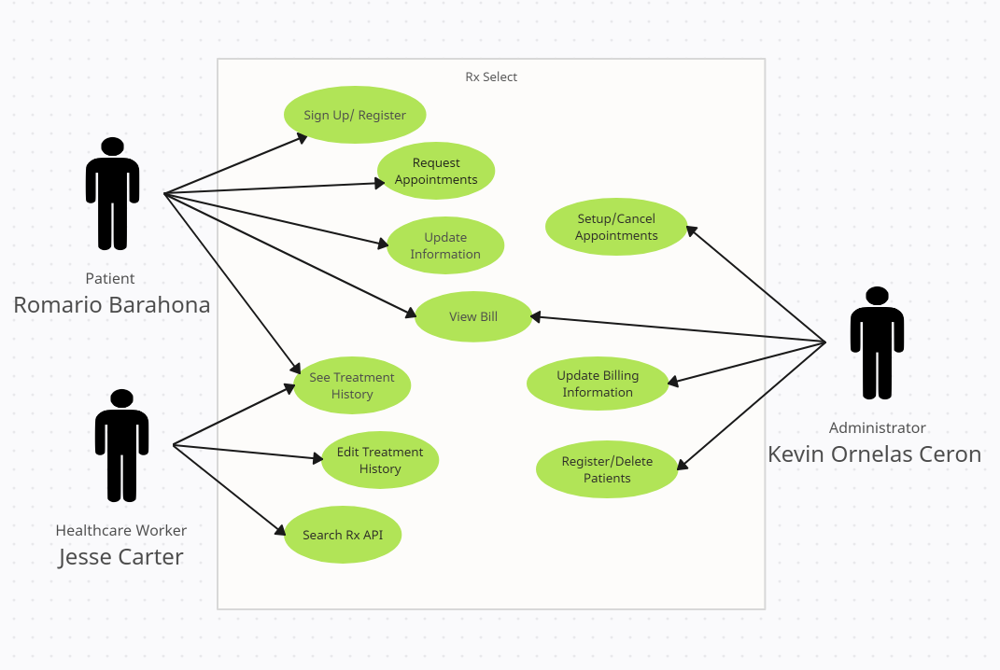

# RxSelect
# RxS
# Team Members

Jesse Carter,
Kevin Ornelas Ceron,
Romario Barahona

# Description

Help doctor coordinate treatment plans for patients and allow patients to easily get presciptions from doctor.

RxSelect is a powerful and user-friendly medication management app designed to simplify your healthcare routine. With RxSelct, you can effortlessly manage your prescriptions and stay on top of your health journey.

Key Features:

- Symptom-Based Drug Lookup: Easily search for medications based on your symptoms and get accurate, up-to-date information.
- Medication History: Keep a detailed record of your medication history, making it easy to share with healthcare providers. (maybe)
- Healthcare Provider Integration: Seamlessly connect with your healthcare provider to receive prescriptions and updates.

# Use Case Diagram

# Note For SQL Imports
There must be two databases, "code-review" and "patientdb", containing the tables and dummy data found in code-review.sql and patientdb.sql.